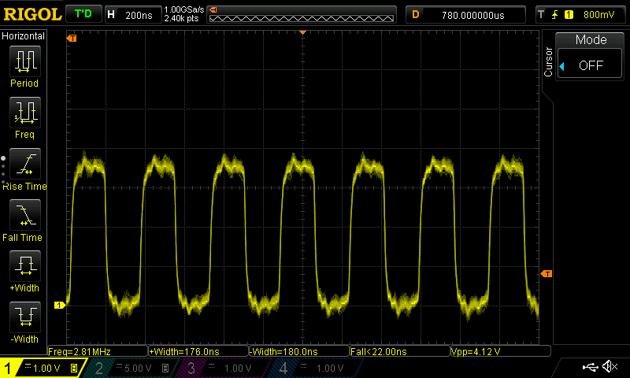
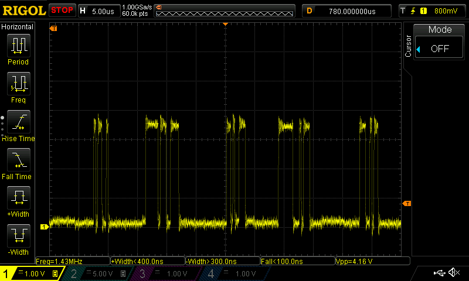
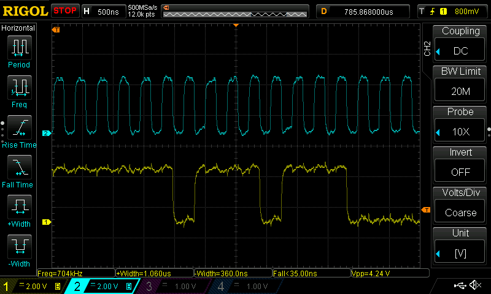

# Fountain of Youth

## Members
* Miles Dai
* Shahul Alam
* Austin Wang
* Alex Cuellar
* Lydia Morales-Anderson
* Chelsea Ajunwa

## Project Updates
### October 13, 2018
The 4-ohm, 3-watt speaker arrived in the mail along with the Neopixels and the MAX98357A 3W amplifier.

The amplifier takes in I2S commands. The Arduino Uno does not actually contain a I2S interface, so the project has been moved to Miles's Teensy 3.2. The Teensy code in `speaker.ino` currently accepts audio signals through USB and generates I2S signals that are fed into the MAX98357A. The pinouts are as follows:

| Pin Name |Function | MAX98357A Pin | Teensy Pin |
|:-:|:-:|:-:|:-:|
| LRCLK | Left-right channel selector | LRC | 23 |
| BCLK | Bit Clock, 1.41 MHz | BCLK | 9 |
| TX | Digital Audio Data Input | DIN | 22 |
| Gain | Audio gain | Gain | - |
| Shutdown | Active low shutdown, also channel selector | SD | - |
| GND | Ground | GND | - |
| Vin | Speaker supply voltage | Vin | - |

**Note that the speaker driver should be driven from the bench power supply at 5V and not the USB port since it has the potential to draw over 400 mA.**

The signals are shown below and were generated with music playing through the USB port.

Bit Clock (probing pin 9 on the Teensy):

Audio Signal (probing pin 22 on the Teensy):

Audio Signal with Bit Clock Timing Synchronization:

The Teensy Audio library has a host of other useful functions found [here](https://www.pjrc.com/teensy/td_libs_Audio.html).

Currently, the 60 Hz sine wave can be generated using something like Audacity to produce the audio signal and then just play that over USB. When generating the signal, avoid using the full amplitude since that causes some noise artifacts in the speaker. 80% seems to work fairly well.